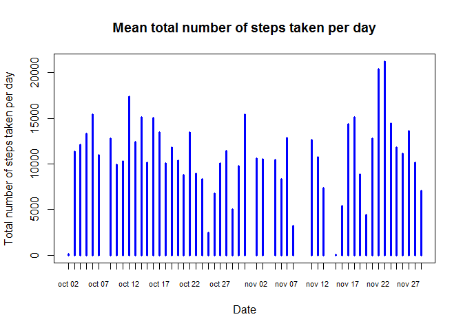
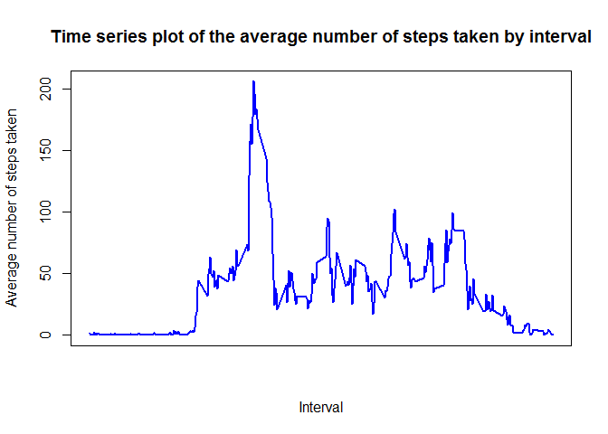
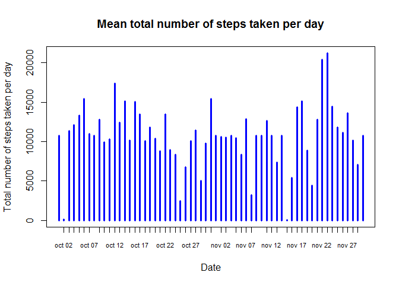
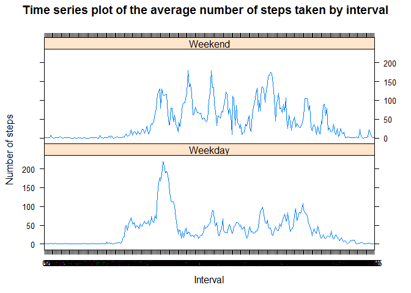

# Reproducible Research coursera: Peer Assessment 1

### Laura Sánchez Burgos


## Introduction

It is now possible to collect a large amount of data about personal movement using activity monitoring devices such as a Fitbit, Nike Fuelband, or Jawbone Up. These type of devices are part of the "quantified self" movement -- a group of enthusiasts who take measurements about themselves regularly to improve their health, to find patterns in their behavior, or because they are tech geeks. But these data remain under-utilized both because the raw data are hard to obtain and there is a lack of statistical methods and software for processing and interpreting the data.

This assignment makes use of data from a personal activity monitoring device. This device collects data at 5 minute intervals through out the day. The data consists of two months of data from an anonymous individual collected during the months of October and November, 2012 and include the number of steps taken in 5 minute intervals each day.


## Loading and preprocessing the data

### Load the data
From the data downloaded [Assigment link] (https://github.com/rdpeng/RepData_PeerAssessment1), we will load the data using `read.csv()` function.
*Set your own working directory.


```r
setwd("C:/Laura/Cursos/Data science/5- Reproducible research/Week 2 - Tools/Assignment/RepData_PeerAssessment1/RepData_PeerAssessment1-master")
data <- read.csv('activity.csv', header = TRUE, sep = ",")
```

To have a look at the data set we will use the funtion `head()`.


```r
head(data)
```

```
##   steps       date interval
## 1    NA 2012-10-01        0
## 2    NA 2012-10-01        5
## 3    NA 2012-10-01       10
## 4    NA 2012-10-01       15
## 5    NA 2012-10-01       20
## 6    NA 2012-10-01       25
```

### Preprocess the data

In order to process the data before the analysis, we will transform the date to Date class (by using `as.Date()`) and interval to Factor class (by using `as.factor()`).


```r
data$date <- as.Date(data$date, format = "%Y-%m-%d")
data$interval <- as.factor(data$interval)
```


## What is mean total number of steps taken per day?

### Code 

For calculating the mean total number of steps by day we will use `aggregate()` function indicating we want to sum the steps by date. We can again have a look at the data generated by using `head()`


```r
dailysteps <- aggregate(steps ~ date, data, sum)
head(dailysteps)
```

```
##         date steps
## 1 2012-10-02   126
## 2 2012-10-03 11352
## 3 2012-10-04 12116
## 4 2012-10-05 13294
## 5 2012-10-06 15420
## 6 2012-10-07 11015
```

### Plot
For visualizing the change by day in total number of steps we generated a histogram by using simply function `plot()`, and determining some format parameters


```r
plot(steps ~ date, dailysteps, xaxt = "n", type = "h", col="blue", lwd=3, main="Mean total number of steps taken per day", xlab= "Date", ylab="Total number of steps taken per day")
axis(1, dailysteps$date, format(dailysteps$date, "%b %d"), cex.axis = .7)
```

 

### Mean and median result

Finally we will calculate the mean and median of the number of steps taken per day, by using respectively `mean()` and `median()` functions.


```r
meansteps   <- mean(dailysteps$steps, na.rm=TRUE)
mediansteps <- median(dailysteps$steps, na.rm=TRUE)
```

The mean is 10766.19 and median is 10765.


## What is the average daily activity pattern?

### Code
For calculating the average of the daily activity pattern we calculate the mean of steps for each interval of 5-minutes and convert the intervals as integers, by using `aggregate()` function and  `as.integer()` function. We can again head it.


```r
intervalsteps <- aggregate(data$steps, by = list(interval = data$interval), FUN=mean, na.rm=TRUE)
intervalsteps$interval <- as.integer(levels(intervalsteps$interval)[intervalsteps$interval])
head(intervalsteps)
```

```
##   interval         x
## 1        0 1.7169811
## 2        5 0.3396226
## 3       10 0.1320755
## 4       15 0.1509434
## 5       20 0.0754717
## 6       25 2.0943396
```

### Plot
We will now create the plot (using `plot()` function again) with the time series of the average number of steps taken in each of the 5-minute intervals:


```r
plot(x ~ interval, intervalsteps, xaxt = "n", type = "l", col="blue", lwd=2.5, main="Time series plot of the average number of steps taken by interval", xlab= "Interval", ylab="Average number of steps taken")
```

 

### Interval with the maximum number of steps

We now calculte which is the 5-minute interval with the maximum average number of steps by using `which.max()`.


```r
maximuminterval <- intervalsteps[which.max(intervalsteps$x),]
```

The 835 interval has the maximum number of steps with an average of 206 steps.


## Imputing missing values

### Total number of missing values

The total number of missing values can be calculated using `is.na()` function.


```r
missingvalues <- sum(is.na(data$steps))
```

The total number of missing values are 2304.

### Strategy for filling in all of the missing values in the dataset

The approach we will use to fill in the missing values will be to replace them with the average of its interval across days. For that we will create a function called `fill`.


```r
fill <- function(data, intervalsteps) {naI <- which(is.na(data$steps))
        replace <- unlist(lapply(naI, FUN=function(idx){
                interval = data[idx,]$interval
                intervalsteps[intervalsteps$interval == interval,]$x
        }))
        fillsteps <- data$steps
        fillsteps[naI] <- replace
        fillsteps
}
```

### New dataset with the missing data filled in

For that we will use the function we just designed: `fill()`. We will head it, and also we will check that are there any missing values remaining


```r
filleddata <- data.frame(steps = fill(data, intervalsteps), date = data$date, interval = data$interval)
head(filleddata)
```

```
##       steps       date interval
## 1 1.7169811 2012-10-01        0
## 2 0.3396226 2012-10-01        5
## 3 0.1320755 2012-10-01       10
## 4 0.1509434 2012-10-01       15
## 5 0.0754717 2012-10-01       20
## 6 2.0943396 2012-10-01       25
```

```r
check <- sum(is.na(filleddata$steps))
```

We can see that the number of missing values is 0, so our new filled data set and the fill function worked perfectly.

### Plot

We will now plot the new data set using the same function described for the mean total number of steps taken per day.


```r
dailystepsfilled <- aggregate(steps ~ date, filleddata, sum)
plot(steps ~ date, dailystepsfilled, xaxt = "n", type = "h", col="blue", lwd=3, main="Mean total number of steps taken per day", xlab= "Date", ylab="Total number of steps taken per day")
axis(1, dailysteps$date, format(dailysteps$date, "%b %d"), cex.axis = .7)
```

 

### Mean and median result

We will calculate the mean and median of the number of steps taken per day, by using the same functions as in the mean total number of steps taken per day.


```r
meanstepsfilled   <- mean(dailystepsfilled$steps, na.rm=TRUE)
medianstepsfilled <- median(dailystepsfilled$steps, na.rm=TRUE)
```

The mean is 10766.19 and median is 10766.19.

### Discusion

Before filling the missing values, our mean and median were respectively 10766.19 and 10765.
After filling the missing values the numbers were 10766.19 and 10766.19.

We can see that the mean didn't changed at all, and the median increased a bit just to be the same as the mean. This means that the impact is not very huge, it just changed a bit the median, but it won't change our predictions and we can use it for further analysis.

## Are there differences in activity patterns between weekdays and weekends?

As alredy discussed, we do this comparison with the data set with filled missing values.

### Create a new factor variable in the dataset

To create a new factor variable in the dataset with two levels "weekday" and "weekend", that indicates if a given date is a weekday or weekend day, we will use `weekdays()` function and a vector combination of it to we will create a new data set with the information required.
We will end by computing the mean by interval using the same function we used for that previously.


```r
weekx <- weekdays(filleddata$date, abbreviate=TRUE)
weekxlevel <- vector()
for (i in 1:nrow(filleddata)) {
    if (weekx[i] == "sab") {
        weekxlevel[i] <- "Weekend"
    } else if (weekx[i] == "dom") {
        weekxlevel[i] <- "Weekend"
    } else {
        weekxlevel[i] <- "Weekday"
    }
}

weekxdata <- data.frame(steps = filleddata$steps, date = filleddata$date, interval = filleddata$interval)
weekxdata$weekxlevel <- weekxlevel
weekxdata$weekxlevel <- factor(weekxdata$weekxlevel)
head(weekxdata)
```

```
##       steps       date interval weekxlevel
## 1 1.7169811 2012-10-01        0    Weekday
## 2 0.3396226 2012-10-01        5    Weekday
## 3 0.1320755 2012-10-01       10    Weekday
## 4 0.1509434 2012-10-01       15    Weekday
## 5 0.0754717 2012-10-01       20    Weekday
## 6 2.0943396 2012-10-01       25    Weekday
```

```r
weekxinterval <- aggregate(steps ~ interval + weekxlevel, data = weekxdata, mean)
names(weekxinterval) <- c("interval", "weekxlevel", "steps")
```

### Plot

For create a comparative panel we will use `lattice`package.


```r
library("lattice")
```

```
## Warning: package 'lattice' was built under R version 3.1.3
```

```r
xyplot(steps ~ interval | weekxlevel, weekxinterval, type = "l", layout = c(1, 2), xlab = "Interval", ylab = "Number of steps", main= "Time series plot of the average number of steps taken by interval")
```

 
